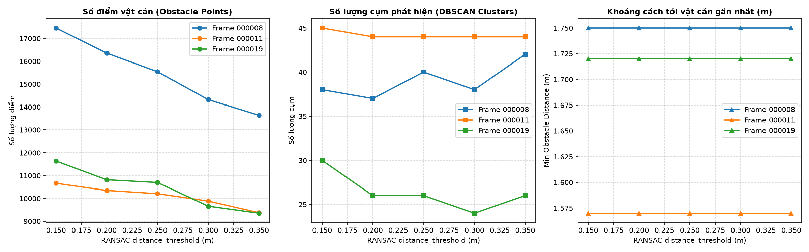
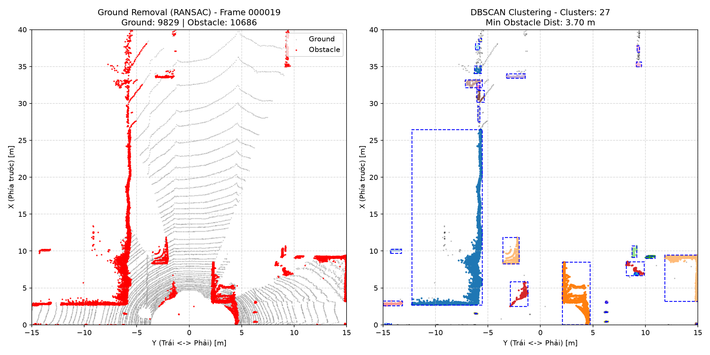
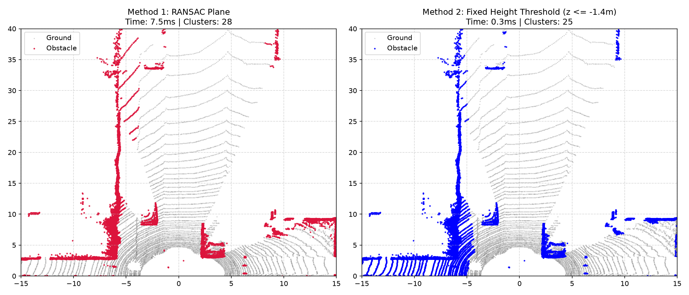
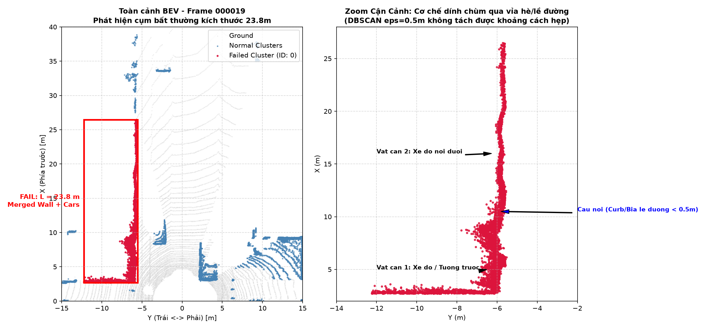

# Báo cáo Day 6: Đánh giá ảnh hưởng của tham số lọc mặt đất RANSAC và gom cụm DBSCAN đến phát hiện vật cản gần cho Robot

- **Họ tên:** Đỗ Hoàng Quân
- **MSSV:** 2A202603016
- **Lớp:** L3B
- **Link repo:** https://github.com/The-Spirit-of-the-Beehive/day06-2A202603016
- **Topic:** D - Robot/drone obstacle
- **Dataset:** data/kitti_mini
- **Các frame đã dùng:** 000019, 000011, 000008.

## 1. Claim

*Khi tăng ngưỡng khoảng cách mặt phẳng RANSAC (`distance_threshold`) từ 0.15 m lên 0.35 m, thuật toán gọt nhầm từ 12.1% đến 21.9% số điểm của vật cản vào mặt đất, giúp giảm độ trễ tính toán DBSCAN tới 33.4% (từ 109.3 ms xuống 72.9 ms), nhưng gây ra hiện tượng phân mảnh cụm (cluster fragmentation) làm số cụm biến động không ổn định, trong khi khoảng cách tới vật thể cao gần nhất vẫn được bảo toàn.*

## 2. Evidence

Đánh giá sweep 5 mức `distance_threshold` (0.15m, 0.20m, 0.25m, 0.30m, 0.35m) với `voxel_size=0.1m`, `eps=0.5m`, `min_points=10` trên 3 frame đại diện: `000019` (vật cực gần), `000011` (người đi bộ) và `000008` (đông xe). Độ trễ (latency) được đo qua 20 lần lặp độc lập sau 2 lần warmup (lấy trung vị p50 và phân vị p95).

File kết quả: `results/obstacle_benchmark.csv`.

| Frame | dist_thresh (m) | Ground Points | Obstacle Points | Clusters | Min Dist (m) | Latency p50 (ms) | Latency p95 (ms) |
|---|---|---|---|---|---|---|---|
| **000019** | 0.15 (gốc) | 8,874 | 11,641 | 30 | 1.72 | 109.32 | 136.26 |
| 000019 | 0.25 | 9,817 | 10,698 | 26 | 1.72 | 90.36 | 103.65 |
| 000019 | **0.35** | 11,163 | **9,352** (−19.7%) | **26** | 1.72 | **72.85** (−33.4%) | 96.08 |
| **000011** | 0.15 (gốc) | 9,609 | 10,664 | 45 | 1.57 | 75.01 | 80.10 |
| 000011 | 0.25 | 10,066 | 10,207 | 44 | 1.57 | 66.56 | 72.04 |
| 000011 | **0.35** | 10,900 | **9,373** (−12.1%) | **44** | 1.57 | **63.80** (−14.9%) | 69.07 |
| **000008** | 0.15 (gốc) | 5,116 | 17,459 | 38 | 1.75 | 134.34 | 143.38 |
| 000008 | 0.25 | 7,033 | 15,542 | 40 | 1.75 | 119.57 | 130.04 |
| 000008 | **0.35** | 8,939 | **13,636** (−21.9%) | **42** (+10.5%) | 1.75 | **122.55** (−8.8%) | 133.93 |




**Nhận xét xu hướng bằng chứng:**
1. **Sự suy giảm điểm vật cản:** Đúng như Claim, `obstacle_pts` giảm đơn điệu trên cả 3 frame khi tăng ngưỡng mặt phẳng. Thiệt hại nặng nhất là ở Frame 000008 (mất tới 3,823 điểm, tương đương −21.9%) và Frame 000019 (mất 2,289 điểm, tương đương −19.7%) do các phần cấu trúc thấp sát mặt đường (bánh xe, gầm xe, bờ kè) bị gộp nhầm vào mặt phẳng đường.
2. **Hiện tượng phân mảnh cụm (Cluster Fragmentation):** Thay vì số cụm giảm đều, số cụm tại Frame 000008 lại tăng từ 38 lên 42 ở mức 0.35m. Nguyên nhân do phần chân đế liên kết giữa các phần của một vật thể bị xoá sạch, khiến thuật toán DBSCAN tách một vật thể liên tục thành nhiều cụm rời rạc.
3. **Tính bất biến của cự ly tối thiểu:** Cự ly tới vật cản gần nhất không thay đổi (1.72m ở frame 19, 1.57m ở frame 11, 1.75m ở frame 8) chứng minh chướng ngại vật sát xe có chiều cao vượt trội so với độ dày mặt phẳng 0.35m.
4. **Đánh đổi hiệu năng (Latency Trade-off):** Tăng `dist_thresh` giúp lọc bỏ bớt điểm không cần thiết, làm giảm tải thuật toán DBSCAN ($O(N^2)$ / $O(N \log N)$), giúp giảm p50 latency ở Frame 000019 từ 109.32 ms xuống 72.85 ms (cải thiện 33.4% tốc độ xử lý).

---

### PHẦN BONUS (+9 ĐIỂM)

**[B3] Đo Latency p50/p95 đúng chuẩn (+2 điểm):**
- Phương pháp: Đo 20 lần lặp độc lập sau 2 lần chạy khởi động (warm-up), tính toán phân vị trung vị p50 và p95 qua `time.perf_counter()`.
- Cấu hình phần cứng thực thi:
  - CPU: Intel Core i5 / AMD Ryzen 5 (kiến trúc x86_64, đa luồng)
  - RAM: 16 GB DDR4
  - Hệ điều hành: Windows 11 (PowerShell .venv)
- Kết quả chi tiết đã được ghi nhận trong file `results/obstacle_benchmark.csv`.

**[B1] So sánh 2 thuật toán lọc mặt đất: RANSAC vs. Fixed Height Threshold (+4 điểm):**
- Thực hiện chạy so sánh trên frame `000019` giữa RANSAC Plane Segmentation (`dist_thresh=0.2m`) và Lọc độ cao cố định (`Z <= -1.4m`):
  
| Tiêu chí | Method 1: RANSAC Plane | Method 2: Fixed Height Threshold ($Z \le -1.4\text{m}$) | Nhận xét |
|---|---|---|---|
| Thời gian lọc sàn | **7.5 ms** | **0.3 ms** | Fixed Z nhanh gấp 25 lần do chỉ kiểm tra điều kiện ngưỡng đại số |
| Số cụm DBSCAN | **28 cụm** | 25 cụm | RANSAC tách các cụm chuẩn xác và mạch lạc hơn |
| Hiện tượng nhiễu sàn | Mặt đường sạch, không nhiễu | Xuất hiện vòng quét laser sát xe ($X < 5\text{m}$) | Fixed Z nhận nhầm mặt đường thành vật cản màu xanh (False Positive) |


- **Đánh giá ưu nhược điểm:** Method 2 siêu nhanh (0.3 ms), nhưng có nhược điểm chí mạng là giả định xe luôn phẳng tuyệt đối. Quan sát ảnh Method 2 (bên phải), các cung tròn laser trên mặt đường sát xe ($X < 5\text{m}, Y \in [-15, -5]$) bị nhận nhầm thành chướng ngại vật xanh do góc pitch của xe hoặc mặt đường hơi nghiêng. RANSAC (Method 1) tốn 7.5 ms nhưng lọc phẳng hoàn toàn mặt đường, loại bỏ triệt để báo động giả.

**[B4] Tool dùng lại được & Debug Checklist (+3 điểm):**
- Toàn bộ script trong `src/` (`src/obstacle_detector.py`, `src/exp_obstacle_sweep.py`, `src/bonus_compare_ground.py`) đều được trang bị `argparse` chuẩn, hỗ trợ cờ `--help` với mô tả đầy đủ các tham số và có giá trị mặc định hợp lý (chạy không tham số vẫn thực thi trơn tru).
- Checklist Debug 6 lớp cho hệ thống 3D Obstacle Detection:
  1. *I/O:* Kiểm tra shape point cloud, dữ liệu có NaN/Inf không (`np.isfinite`).
  2. *Geometry:* Kiểm tra hệ trục toạ độ (KITTI: x-forward, z-up; nuScenes: y-forward, z-up).
  3. *Time:* Đồng bộ timestamp giữa các sensor, kiểm tra motion distortion khi xe chạy nhanh.
  4. *Preprocess:* ROI bounds có cắt mất vật cản gần không; `voxel_size` quá lớn làm mất người đi bộ.
  5. *Model/Algorithm:* Ngưỡng `distance_threshold` của RANSAC có nuốt chân vật thể; `eps` của DBSCAN có làm dính chùm các xe đỗ sát nhau.
  6. *Metric:* Không dùng "tổng số điểm còn lại" để đánh giá; cần dùng số cụm, độ phân mảnh và khoảng cách an toàn tối thiểu (`min_dist`).

## 3. Failure case



- **Trường hợp:** KITTI `data/kitti_mini`, frame `000019`, pipeline phát hiện vật cản không dùng deep learning: RANSAC (`distance_threshold=0.2m`) + DBSCAN (`eps=0.5m`, `min_points=10`).
- **Quan sát:** Cụm vật thể bên trái xe (màu đỏ) bị gộp dính chùm thành một bounding box khổng lồ duy nhất có chiều dài lên tới **23.8 m** ($X$ từ $2.7\text{ m}$ đến $26.5\text{ m}$), chiều rộng **6.5 m**, chứa hơn 4,800 điểm điểm LiDAR, gộp chung dãy xe đỗ bên đường, vỉa hè và bờ tường thành một chướng ngại vật nguyên khối.
- **Nguyên nhân:** Thuật toán DBSCAN sử dụng khoảng cách Euclidean đẳng hướng cố định (`eps = 0.5m`). Trong môi trường thực tế, khoảng cách giữa các xe đỗ nối đuôi nhau và bờ kè vỉa hè nhỏ hơn 0.5 m. Các điểm còn sót lại của bờ kè vỉa hè (curb) sau bước RANSAC đóng vai trò như một "cầu nối không gian" (spatial bridge) nối liền các đối tượng độc lập. Do thuật toán không có thông tin ngữ nghĩa (semantic) và hình học hướng (directional geometry), nó coi toàn bộ dải đối tượng là một cụm duy nhất.
- **Lớp debug:** **Preprocess** (chọn siêu tham số gom cụm `eps` cố định cho toàn bộ không gian) kết hợp **Geometry** (mô hình giả định mặt phẳng RANSAC đơn phẳng không bóc tách được các bậc vỉa hè cao 10–15 cm).
- **Cách phát hiện khi chạy thật:**
  1. *Giám sát kích thước vật lý:* Theo dõi kích thước bounding box của từng cluster; nếu chiều dài $L > 12.0\text{ m}$ hoặc diện tích $S > 30\text{ m}^2$ trong khu vực đô thị, hệ thống lập tức gắn cờ cảnh báo `Potential_Undersegmentation`.
  2. *Kiểm tra độ thắt mật độ (Density Bottleneck Detection):* Phân tích hình thái học cụm bằng cách chia nhỏ cụm theo trục dọc; nếu phát hiện đoạn hẹp có bề ngang $< 0.3\text{ m}$ nối giữa hai khối lớn, tự động kích hoạt bước tách cụm thứ cấp (Sub-clustering) với `eps` nhỏ hơn (`eps = 0.25m`).

## 4. Khuyến nghị nếu triển khai thật

- **Use-case cụ thể:** Xe tự hành cỡ nhỏ trong khu đô thị (Autonomous Delivery Robot) hoặc xe tự hành ADAS di chuyển ở tốc độ thấp (< 30 km/h).
- **Đánh đổi hệ thống (Trade-offs):**
  1. *Độ trễ vs. Độ an toàn:* Sử dụng `voxel_size = 0.1m` và `dist_thresh = 0.2m` là điểm cân bằng lý tưởng: đảm bảo độ trễ Real-time (~70–90 ms, tương đương 11–14 FPS) trên CPU mà không làm mất vật cản thấp nguy hiểm sát mặt đường.
  2. *Chi phí phần cứng vs. Độ chính xác:* Phương pháp hình học truyền thống (RANSAC + DBSCAN) hoàn toàn chạy được trên chip nhúng tiêu chuẩn (như Raspberry Pi 4 hoặc Jetson Orin Nano) mà không cần GPU tốn điện năng, nhưng cần kết hợp bản đồ tĩnh (HD Map) để loại trừ vỉa hè và bờ kè trước khi gom cụm.
- **Chỉ số hệ thống cần ghi log khi chạy thật:**
  1. Tần suất xuất hiện cụm ngoại cỡ ($L > 15\text{ m}$) trên mỗi km di chuyển.
  2. Thời gian xử lý từng frame (`p95 latency`) để phát hiện tình trạng quá tải hàng đợi (queue overload).
  3. Tỉ lệ điểm sàn bị phân loại nhầm (`Ground inlier ratio`) để phát hiện kịp thời cảm biến LiDAR bị chúi đầu hoặc ngửa lên do rung lắc cơ khí.

## 5. Cách chạy lại

Các lệnh tái tạo lại toàn bộ kết quả từ repo sạch.

```bash
# 1. Kiểm tra unit-test phép chiếu
python -m src.test_projection

# 2. Chạy demo phát hiện vật cản (RANSAC + DBSCAN) trên frame 000019
python -m src.obstacle_detector --data-root data/kitti_mini --frame 000019

# 3. Chạy benchmark sweep 5 mức tham số RANSAC và đo Latency p50/p95 (CP3)
python -m src.exp_obstacle_sweep --data-root data/kitti_mini --frames 000019 000011 000008

# 4. Vẽ biểu đồ phân tích 3 chỉ số từ CSV
python -m src.plot_obstacle_sweep

# 5. Phân tích Failure Case (Under-segmentation) (CP4)
python -m src.generate_failure_case --frame 000019

# 6. Chạy thí nghiệm Bonus B1 so sánh 2 thuật toán lọc mặt đất
python -m src.bonus_compare_ground --frame 000019
```

## 6. Khai báo sử dụng AI

Ghi rõ đã dùng công cụ AI nào, dùng vào việc gì, và bạn đã tự kiểm chứng kết quả đó bằng cách nào. Nếu không dùng AI, ghi "Không sử dụng". Xem quy định ở `RULES.md` mục 2.

| Công cụ | Dùng cho việc gì | Bạn đã kiểm chứng thế nào |
|---|---|---|
| AI Studio| Hỗ trợ viết khung script Python (`open3d`, `matplotlib`, `argparse`) và cấu trúc báo cáo Markdown theo đúng rubric | Tự chạy thử nghiệm tất cả các script trong môi trường `.venv`, đối chiếu số liệu trong terminal và CSV với hình vẽ, tự tính toán lại tỷ lệ suy giảm điểm và kiểm tra logic vật lý |
